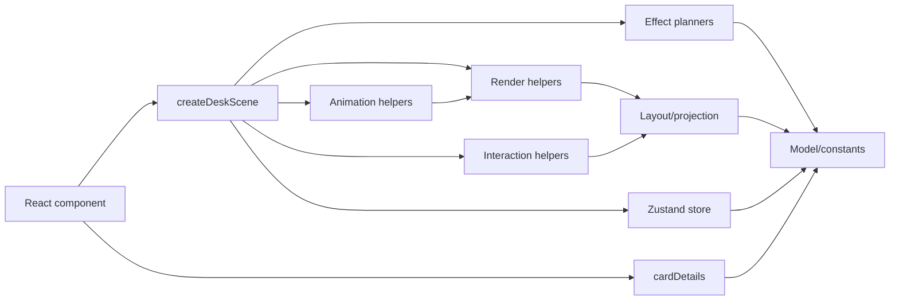

# Architecture

The prototype is split into engine layers so the board can evolve into a game-like system without turning the React component into the main engine.

## Layers

- React: `src/components`
  - `IsometricDesk.tsx` mounts the Pixi scene and places screen-space overlays.
  - `card-inspector/*` renders selected-card details as a HUD, not as board geometry.
  - HUD overlays can report occupied screen insets to the scene controller; the Pixi desk may react with camera offset, but HUD size must not become board geometry.
  - React does not know placement rules or projection math.

- Store: `src/store/gameStore.ts`
  - Holds cards, columns, placements, and drag state.
  - Holds UI-facing state that is derived from engine interaction, such as `selectedCardId`.
  - Exposes actions for drag lifecycle and card movement.

- Model: `src/engine/model`
  - `boardTypes.ts`: stable domain types.
  - `gameConstants.ts`: board geometry, card size, zoom bounds, colors.
  - `boardState.ts`: initial state.
  - `cardPresentation.ts`: labels, colors, codes, and risk summaries derived from card data.
  - `cardDetails.ts`: pure card-detail view model used by the React HUD.
  - `placementRules.ts`: slot parsing, visible row count, free slot lookup, card moves.

- Layout: `src/engine/layout`
  - Converts board coordinates to screen coordinates.
  - Computes desk, column, slot, and card-rest geometry.

- Effects: `src/engine/effects`
  - Converts model changes into renderer-agnostic effect plans.
  - `boardRowEffects.ts`: compares previous/next row counts, lists removed slots, and decides which board height motion runs immediately vs after slot collapse.

- Render: `src/engine/render`
  - `createDeskScene.ts`: Pixi lifecycle, pointer events, store subscription.
  - Executes effect plans from `src/engine/effects`; it should not decide row growth/shrink rules directly.
  - `cardMotionLoop.ts`: requestAnimationFrame loop for card dirty-checking and physical motion updates.
  - `boardRenderer.ts`: desk, columns, labels, empty slots.
  - `cardView.ts`: card graphics, card text, shadows, hit polygons.
  - `cardTypography.ts`: title line fitting and two-line ellipsis for card text.
  - `textTransform.ts`: surface-aligned Pixi text transforms.
  - `pixiPrimitives.ts`: reusable polygon drawing and polygon scaling helpers.

- Interaction: `src/engine/interaction`
  - Hit testing for cards and columns.
  - Adjacent-column drop validation.

- Animation: `src/engine/animation`
  - GSAP lift/landing tweens.
  - Per-frame physical drag response.
  - Hover/held visual state tweens for cards.

- UI Motion: `src/styles/motion.css`
  - Reusable CSS spring primitives for React HUD and interface elements.
  - Prefer these classes for cartoon UI entrance/pop effects before adding one-off component keyframes.

## Dependency Direction

React can depend on render scene APIs. Render can depend on layout, model, interaction, animation, and store. Model must stay independent from Pixi, React, and GSAP.

## Current Composition

The right-hand card inspector is a React HUD overlay. It must not be included in `getDeskWidth`, `deskPolygon`, `workspacePolygon`, or any Pixi board layout. If a future feature needs a real object on the tabletop, model it as board geometry separately from HUD components.

When the inspector is visible on wide screens, it reports its right-side inset to `createDeskScene`. The scene applies a bounded spring camera shift so the board yields space to the HUD without changing board rules, slot geometry, or card placements.
