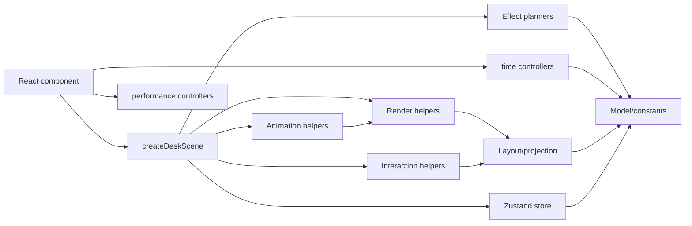

# Architecture

The prototype is split into engine layers so the board can evolve into a game-like system without turning the React component into the main engine.

## Layers

- React: `src/components`
  - `IsometricDesk.tsx` mounts the Pixi scene.
  - `AbstractBackground.tsx` mounts the animated background controller.
  - `GameTicker.tsx` mounts the game-time ticker.
  - `DebugOverlay.tsx` mounts the FPS meter.
  - `GameClock.tsx` renders the screen-space time HUD from SVG digit assets.
  - React does not know placement rules or projection math.

- Store: `src/store/gameStore.ts`
  - Holds cards, columns, placements, and drag state.
  - Holds the game clock and exposes the tick action.
  - Holds UI-facing state that is derived from engine interaction, such as the modal inspector card id and transition phase.
  - Exposes actions for drag lifecycle and card movement.

- Model: `src/engine/model`
  - `boardTypes.ts`: stable domain types.
  - `gameConstants.ts`: board geometry, card size, zoom bounds, colors.
  - `gameClock.ts`: pure game-time state, tick duration, day bounds, and time formatting.
  - `boardState.ts`: initial state.
  - `cardPresentation.ts`: labels, colors, codes, and risk summaries derived from card data.
  - `cardDetails.ts`: pure card-detail view model used by the Pixi inspector.
  - `placementRules.ts`: slot parsing, visible row count, free slot lookup, card moves.

- Time: `src/engine/time`
  - Owns reusable runtime time controllers.
  - `gameTicker.ts`: fixed interval controller for game ticks.

- Performance: `src/engine/performance`
  - Owns measurement controllers.
  - `fpsMeter.ts`: requestAnimationFrame FPS sampler for the debug overlay.

- Layout: `src/engine/layout`
  - Converts board coordinates to screen coordinates.
  - Computes desk, column, slot, and card-rest geometry.
  - `viewportConfig.ts`: camera composition, edge margins, workspace fit margins, and the reserved top band for the future game header.

- Effects: `src/engine/effects`
  - Converts model changes into renderer-agnostic effect plans.
  - `boardRowEffects.ts`: compares previous/next row counts, lists removed slots, and decides which board height motion runs immediately vs after slot collapse.

- Render: `src/engine/render`
  - `animatedBackground.ts`: canvas lifecycle for the animated page background.
  - `backgroundPattern.ts`: generated background pattern geometry and drawing.
  - `createDeskScene.ts`: Pixi lifecycle, pointer events, store subscription.
  - Executes effect plans from `src/engine/effects`; it should not decide row growth/shrink rules directly.
  - `sceneRowMotion.ts`: owns runtime row-growth/shrink animation state and removed-slot collapse effects.
  - `sceneViewport.ts`: owns zoom and camera offset.
  - `sceneEntities.ts`: syncs Pixi labels/card views with model state and destroys stale Pixi objects.
  - `sceneCardLayout.ts`: applies model placements to card rest poses and starts card hop motion when compacted slots move.
  - `inspectorLayout.ts`: screen-space modal target sizing, host-local conversion, and modal-shell hit testing.
  - `cardMotionLoop.ts`: requestAnimationFrame loop for card dirty-checking and physical motion updates.
  - `boardRenderer.ts`: desk, columns, labels, empty slots.
  - `cardView.ts`: card graphics, card text, shadows, hit polygons.
  - `inspectorRenderer.ts`: Pixi screen-space inspector content and backdrop drawn over the transformed card shell.
  - `cardTypography.ts`: title line fitting and two-line ellipsis for card text.
  - `textTransform.ts`: surface-aligned Pixi text transforms.
  - `pixiPrimitives.ts`: reusable polygon drawing and polygon scaling helpers.

- Interaction: `src/engine/interaction`
  - Hit testing for cards and columns.
  - Adjacent-column drop validation.

- Animation: `src/engine/animation`
  - GSAP lift/landing tweens.
  - Per-frame physical drag response.
  - Hover/held visual state tweens for cards.
  - Pixi-card inspector tweens that transform a tabletop card into a screen-space modal shell and back.

- UI Motion: `src/styles/motion.css`
  - Reusable CSS spring primitives for React overlays and interface elements.
  - Prefer these classes for cartoon UI entrance/pop effects before adding one-off component keyframes.

## Dependency Direction

React can depend on render scene APIs. Render can depend on layout, model, interaction, animation, and store. Model must stay independent from Pixi, React, and GSAP.

## Current Composition

The board reserves a top screen band through `src/engine/layout/viewportConfig.ts`. This reserve is part of zoom-limit and camera-fit math, so maximum zoom keeps the playable columns below the future header area instead of visually offsetting the desk after layout.

The game clock is deliberately separate from the Pixi board scene. `GameTicker.tsx` mounts `createGameTicker`, which updates `state.clock` every `GAME_TICK_MS`, while `createDeskScene.ts` only syncs when board-relevant store slices change. Do not route clock-only updates through Pixi scene synchronization unless a future board visual explicitly depends on time.

The animated page background is also separate from React component state. `AbstractBackground.tsx` only mounts `createAnimatedBackground`; the controller owns canvas sizing, reduced-motion behavior, pointer parallax, and its single scheduled draw loop. Do not add canvas timers or direct drawing back into React components.

Performance notes live in `docs/optimization-notes.md`. Read that file before render, animation, timing, background, or game-loop work, and update it whenever a performance-motivated change is made.

The card inspector is a Pixi screen-space modal. It is drawn over the board by `inspectorRenderer.ts`, but it must not be included in `getDeskWidth`, `deskPolygon`, `workspacePolygon`, or any board layout calculation. If a future feature needs a real object on the tabletop, model it as board geometry separately from modal UI.

When the player clicks a card info icon, the same Pixi card hides its tabletop text, lifts, interpolates from board perspective to a centered rectangle, grows into the inspector shell, and then reveals inspector content. The backdrop is another Pixi layer that blocks tabletop input while the modal is open.

When the modal closes, Pixi hides the inspector content, morphs the shell back toward the lifted card shape, returns it to its slot, restores card text, and only then clears the store inspector state.

## Refactor Boundaries

Keep `createDeskScene.ts` as an orchestrator. It can wire browser events, store subscriptions, and render passes, but new persistent runtime state should usually go into one of the focused scene modules.

- Camera and zoom runtime state: `sceneViewport.ts`.
- Slot-count animation, delayed shrink, and removed-slot collapse runtime state: `sceneRowMotion.ts`.
- Pixi object creation/destruction for cards and labels: `sceneEntities.ts`.
- Card rest-position synchronization and compacted-slot hop animation: `sceneCardLayout.ts`.

If a change needs a pure rule, put it under `src/engine/model` or `src/engine/effects` before teaching Pixi how to visualize it.
