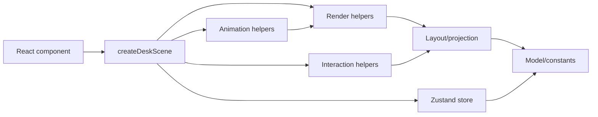

# Architecture

The prototype is split into engine layers so the board can evolve into a game-like system without turning the React component into the main engine.

## Layers

- React: `src/components/IsometricDesk.tsx`
  - Mounts the Pixi scene.
  - Displays zoom controls.
  - Does not know placement rules or projection math.

- Store: `src/store/gameStore.ts`
  - Holds cards, columns, placements, and drag state.
  - Exposes actions for drag lifecycle and card movement.

- Model: `src/engine/model`
  - `boardTypes.ts`: stable domain types.
  - `gameConstants.ts`: board geometry, card size, zoom bounds, colors.
  - `boardState.ts`: initial state.
  - `placementRules.ts`: slot parsing, visible row count, free slot lookup, card moves.

- Layout: `src/engine/layout`
  - Converts board coordinates to screen coordinates.
  - Computes desk, column, slot, and card-rest geometry.

- Render: `src/engine/render`
  - `createDeskScene.ts`: Pixi lifecycle, pointer events, store subscription.
  - `boardRenderer.ts`: desk, columns, labels, empty slots.
  - `cardView.ts`: card graphics, card text, shadows, hit polygons.
  - `textTransform.ts`: surface-aligned Pixi text transforms.
  - `pixiPrimitives.ts`: reusable polygon drawing helpers.

- Interaction: `src/engine/interaction`
  - Hit testing for cards and columns.
  - Adjacent-column drop validation.

- Animation: `src/engine/animation`
  - GSAP lift/landing tweens.
  - Per-frame physical drag response.

## Dependency Direction

React can depend on render scene APIs. Render can depend on layout, model, interaction, animation, and store. Model must stay independent from Pixi, React, and GSAP.

